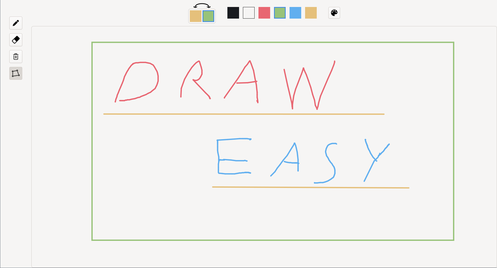

# DrawEasy



## Description

Points recieved: 50/55

This was a project for the ITU class at VUT FIT. The project was to create an application with a modern graphical user interface. This was
part of a team project where every member created the same application, but with their own design and a different technology. This application
was created with GTK 4 and C++.

The document detailing the design process and the asignment are in the design directory. 

## Dependencies

Dependencies are managed with nix shells and direnv.

They are written here for clarity:

```
gtkmm4
pkg-config
meson
ninja
```

## Compilation

To compile the application run:

`meson setup out`

Then in the"out" directory run:

```bash
ninja && ./draweasy
```
